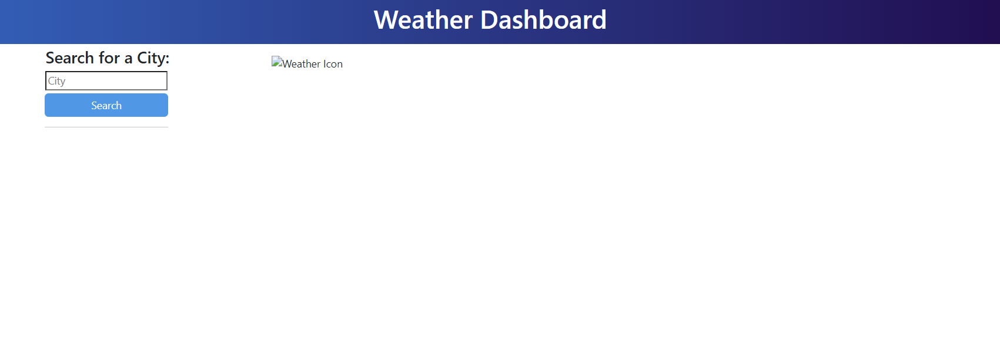

# weather-dashboard
8th Module Challenge for the Front-End Web Development Bootcamp

## Description

This is my 8th challenge for the bootcamp. I have struggled with this one the most so I focused on getting what I could working rather than the design. 

## Screenshot

## Live

Link: https://rajpreetkr.github.io/weather-dashboard

## Credits

I used the following to help me get my final code:
https://www.w3schools.com/css/css3_gradients.asp
https://www.w3schools.com/jquery/jquery_dom_add.asp
Tutor

## Lisence

MIT Lisence
